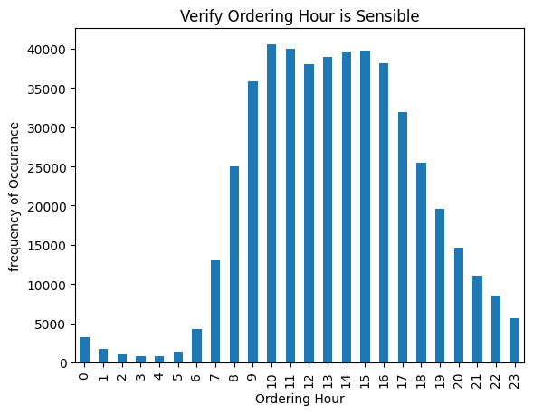
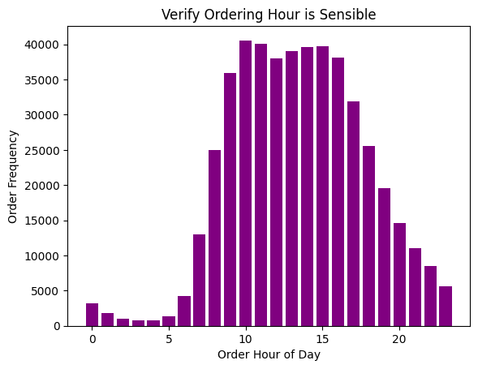
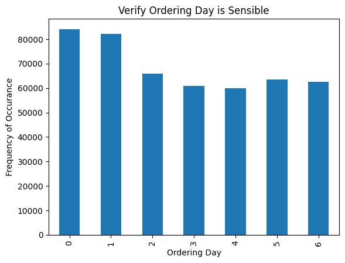
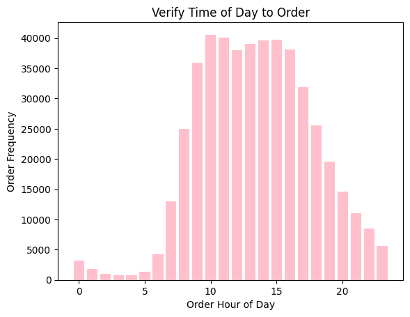
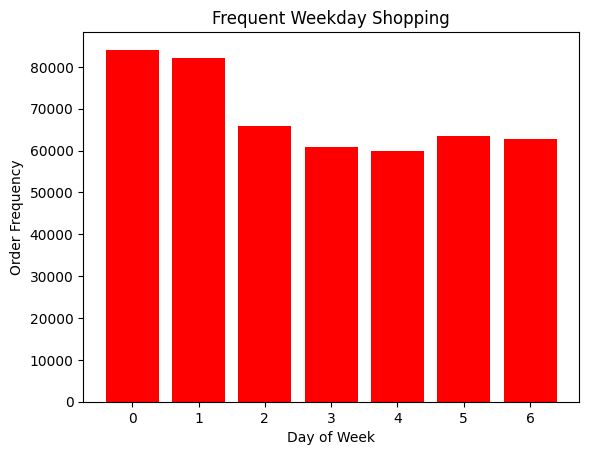
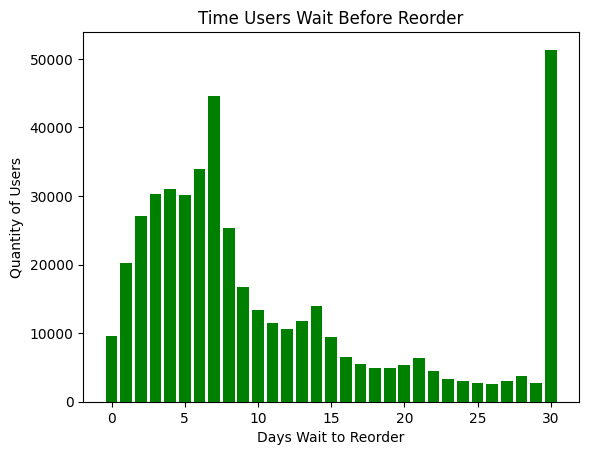
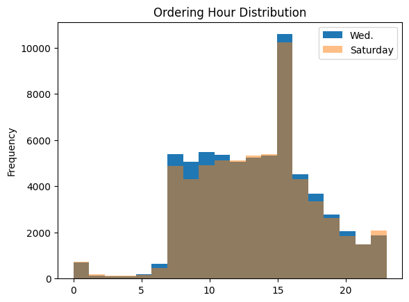
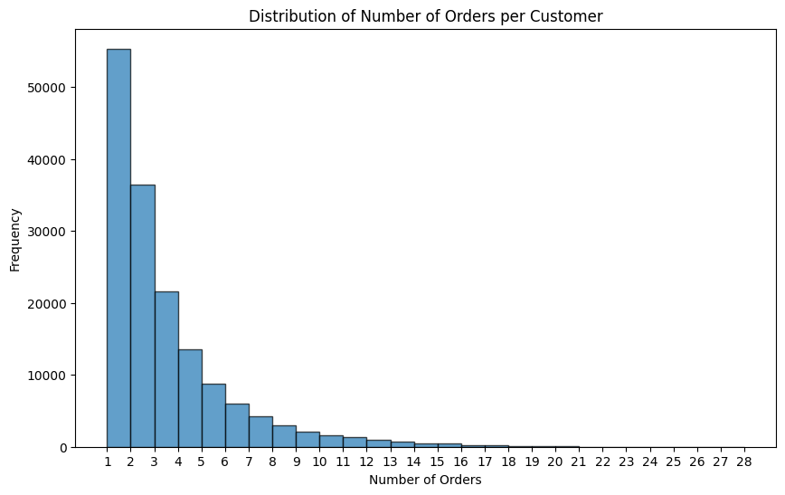
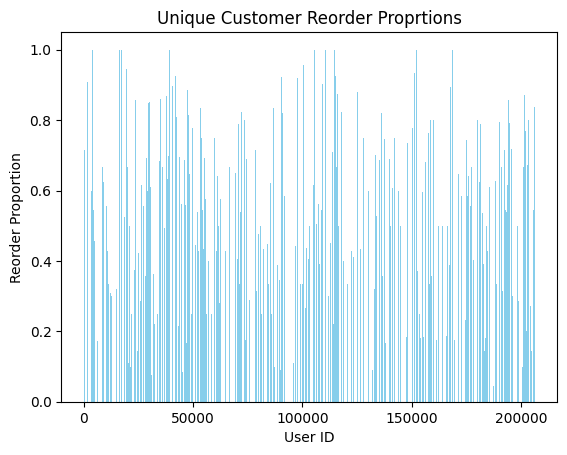

# Instacart_Data_Review
Examination of Instacart data to detect trends of previous customers.  Provided business reccomendations.  

🛒 Instacart Purchase Patterns: From Raw Data to Consumer Insight
Imagine you’ve just been handed raw transactional logs from a major grocery delivery platform—millions of rows, scattered across departments, aisles, and time. How do you transform this disorganized dataset into business intelligence?

This project tackles that challenge using real anonymized data from Instacart. The goal? To clean, explore, and extract patterns that tell a story about how people shop—when they order, what they reorder, and whether they come back at all.

Through careful data wrangling and exploratory data analysis, this project answers:

Which day and hour are shoppers most active?

What’s the reorder behavior of Instacart users?

Which products dominate shopping carts—and why?

📂 Data Sources
The analysis integrates five CSV files:

orders.csv – customer order metadata (order time, user ID, etc.)

products.csv – product details (names, departments, aisles)

order_products.csv – product-level purchases per order

aisles.csv – names for grocery aisles

departments.csv – names for grocery departments

### 🧠 Techniques & Industry-Ready Skills Demonstrated

| Category              | Skill/Technique                                                                 |
|-----------------------|----------------------------------------------------------------------------------|
| **Data Engineering**  | Merged multiple CSVs using primary/foreign key relationships                     |
|                       | Cleaned nulls, removed duplicates, normalized casing                            |
|                       | Converted datatypes for memory-efficient analysis                               |
| **Exploratory Data Analysis** | Identified order behavior trends by day and hour                        |
|                       | Analyzed customer churn and reorder patterns                                    |
|                       | Aggregated top products and visualized purchasing behavior                      |
| **Communication**     | Derived actionable insights with clear graphical representation                 |
|                       | Connected raw metrics to real-world customer behavior                          |

🛠 Installation
Clone this repository or download the .ipynb file.

Make sure you have Python 3.8+ installed.

Install dependencies:

bash
Copy
Edit
pip install pandas numpy matplotlib seaborn jupyter
Launch Jupyter Notebook:

bash
Copy
Edit
jupyter notebook

🚀 Usage
Open the file Instacart Pattern Exploration.ipynb and run the cells in order. The notebook walks through:
Loading and preprocessing Instacart order data
Grouping and aggregating product-level and user-level patterns
Visualizing order frequencies and product popularity
Interpreting insights around reordering and shopping habits

📁 Project Structure
bash
Copy
Edit
Instacart Pattern Exploration.ipynb    # Main analysis notebook
README.md                              # Project documentation

⚙️ Technologies Used
Python
Jupyter Notebook
Pandas
NumPy
Seaborn
Matplotlib

## 📸 Visual Insights from Instacart Data

### 🕘 Orders by Hour of Day

### 📅 Orders by Day of Week

### ⏳ Days Since Prior Order

### 🔁 Most Frequently Reordered Products

### 🍌 Top 20 Products Ordered

### 🛒 Aisle Distribution of Most Ordered Products

### 🧾 Department Distribution of Most Ordered Products

### 📈 Frequency of Orders per User

### 🧪 Null Value Distribution by Aisle and Department

📊 Results & Insights
### 📊 Summary of Results

| Insight                                  | Result                                                                 |
|------------------------------------------|------------------------------------------------------------------------|
| Most active order hours                  | Between 9 AM and 5 PM                                                  |
| Most common ordering days                | Sunday and Monday                                                      |
| Most frequent reorder gap                | 30 days                                                                |
| Highest number of orders per customer    | 1 (suggesting trial users dominate)                                   |
| Most popular product                     | Bananas (66,050 orders, 50% reorders)                                  |
| Top reordered category                   | Fresh produce (15 out of top 20 items ordered were fruits or vegetables) |
| Missing product entries                  | All from `aisle_id=100`, `department_id=21`                            |

✅ Conclusion
This project demonstrates how thoughtful data cleaning and exploratory analysis can transform raw transactional data into clear, actionable insights. By merging five disparate datasets from Instacart and addressing issues such as missing values, duplicates, and inconsistent formatting, we laid a strong foundation for analysis.

Key behavioral patterns emerged:

Ordering activity peaks during weekday business hours, especially on Sundays and Mondays—likely tied to weekly meal planning habits.

Most customers only order once, suggesting strong initial promotions but limited long-term retention.

Reorders reveal customer preferences, with bananas, strawberries, and other fresh produce dominating shopping carts.

Missing product data was isolated to a specific aisle and department, allowing for targeted exclusion or imputation.

The majority of top-selling items were healthy, perishable foods—fruits and vegetables—which speaks to customer priorities and potential supply chain focus areas.

Through this analysis, we showed not only how to prepare and visualize complex datasets but also how to derive meaningful business insights—a critical skill for applied data science roles. Whether improving customer retention strategies or optimizing inventory, this project offers a scalable blueprint for data-driven decision-making in e-commerce and retail analytics.

🤝 Contributing
Contributions are welcome! Fork the repo, make changes, and submit a pull request. Let's explore shopping data together.

 Badges for read me files

